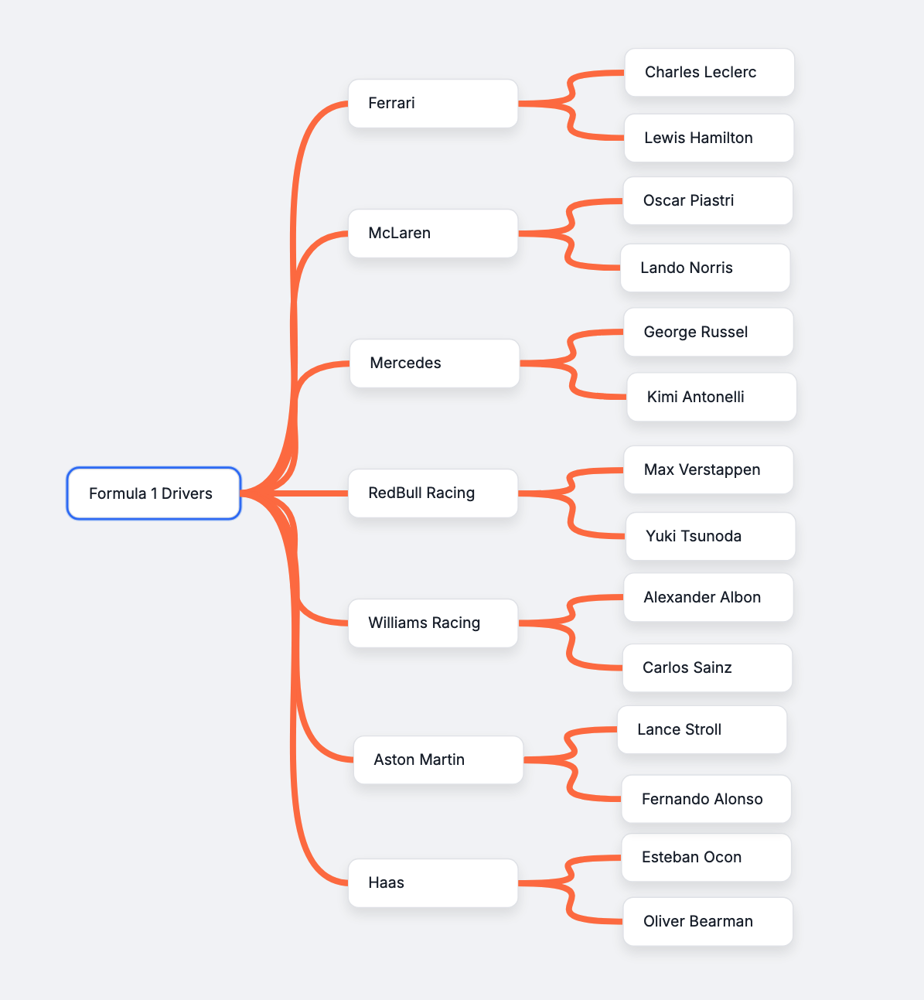
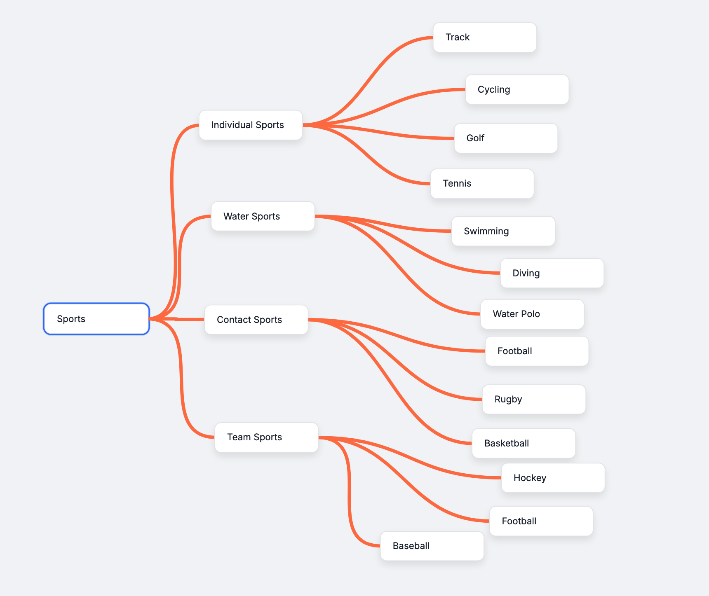

# 🧠 QuickMind — Think Visually, Move Fast

QuickMind is a solo mind mapping app built for speed, clarity, and flow. Create, connect, and organize ideas with powerful keyboard shortcuts and a smooth drag-and-drop interface, perfect for developers, thinkers, and creative chaos-tamers.

> Made in 72 hours during the [Boot.dev Hackathon 2025](https://blog.boot.dev/news/hackathon-2025/) 

---

## ✨ Features

- ⚡ **Rapid Node Creation** – `Enter` to add a child, `Tab` to add a sibling
- 🖱️ **Drag Everything** – Move nodes and pan the map with ease
- ✏️ **Inline Editing** – Double click or press `E` to edit
- ⌨️ **Keyboard Navigation** – Navigate using arrow keys, delete leaf nodes with `Backspace`
- 🧭 **Canvas Controls** – Zoom in/out and center the map with `C`
- ❓ **Shortcut Help Panel** – Press `?` any time for a built-in cheatsheet

---

## 📸 Screenshots

<p align="center">
  
  <br><br>
  
</p>


---

## 🧪 Built With

- **Python** + Flask – backend & templating
- **Vanilla JS** – no frameworks, just fast DOM work
- **LeaderLine.js** – smooth connection lines
- **HTML & CSS** – hand-crafted, responsive, and lightweight

---

## 🚀 Getting Started

```bash
git clone https://github.com/fadelbantan/quickmind.git
cd quickmind
python3 -m venv venv
source venv/bin/activate
pip install -r requirements.txt
python app.py
```
Then open your browser at: http://127.0.0.1:5000
```bash
# For windows:
venv\Scripts\activate
```

📁 File Structure
```
quickmind/
│
├── app.py                 # Flask app
├── templates/
│   └── index.html         # Main UI layout and map container
│   └── base.html          # Shared layout with Inter font, scripts, and styles
├── static/
│   ├── styles.css         # Clean UI styles (Inter, color palette, spacing)
│   ├── mindmap.js         # Core mind map logic, node events, keyboard controls
│   └── util.js            # Lightweight DOM utility functions ($ and $$)
```

---

💡 Why I Built This
This is my first ever hackathon project, and I wanted to build something I’d actually use. I’ve always needed a quick way to jot down ideas without the friction of clunky interfaces, so I made QuickMind.

The goal was speed, simplicity, and keyboard-first design. Now I use it to plan everything from project ideas to this README :)

