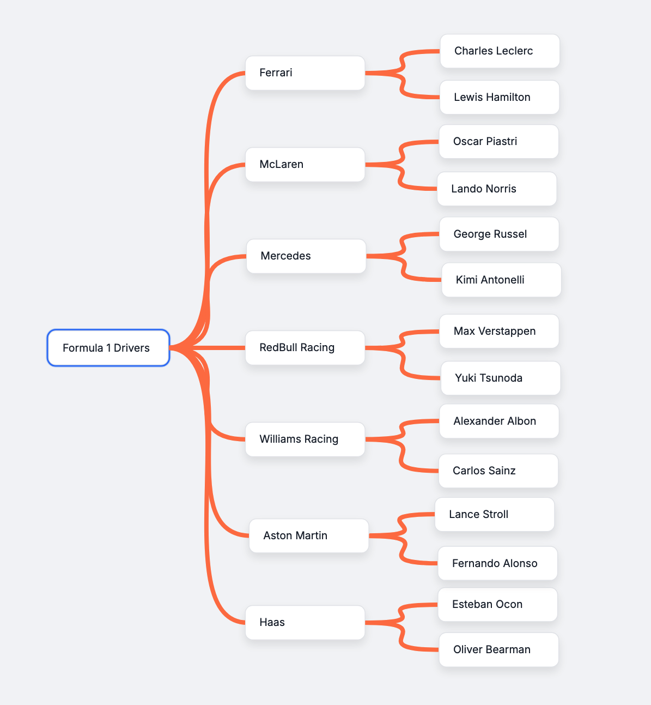
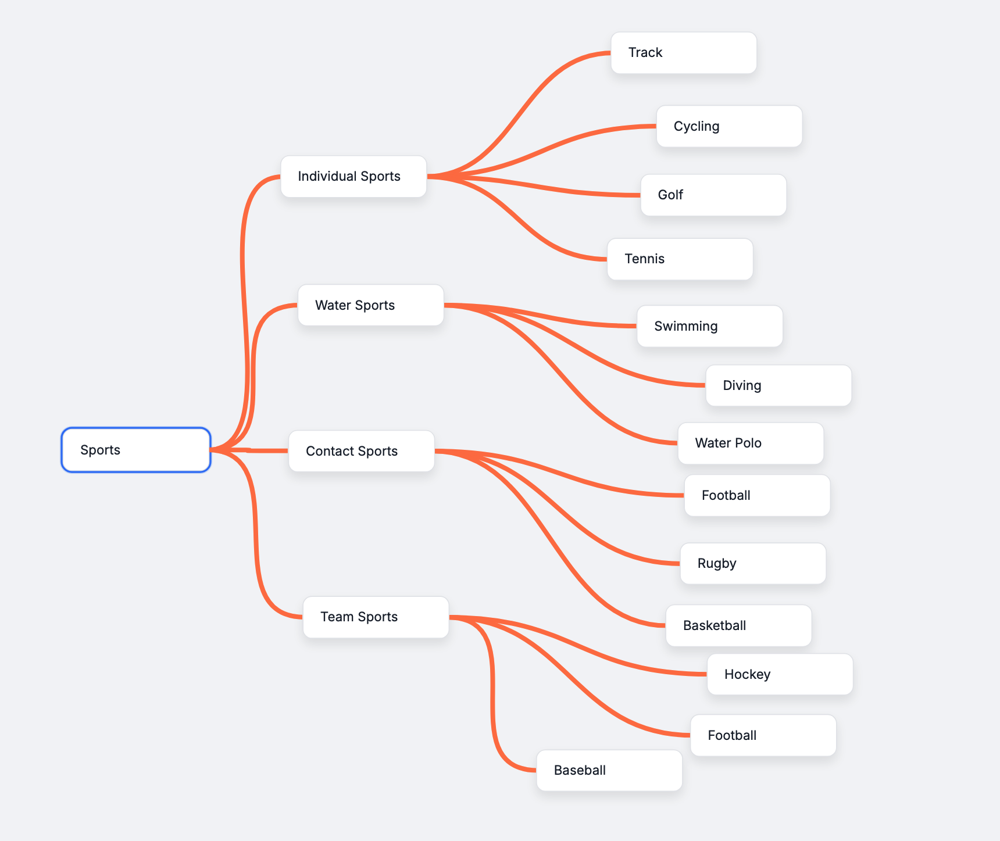

# QuickMind

QuickMind is a solo mind mapping app built for speed, clarity, and flow. Create, connect, and organize ideas with keyboard shortcuts and a smooth drag-and-drop canvas.

> Made in 72 hours during the [Boot.dev Hackathon 2025](https://blog.boot.dev/news/hackathon-2025/)

## Features

- Rapid node creation: `Enter` adds a child, `Tab` adds a sibling
- Drag nodes and pan the canvas freely
- Inline editing: double click or press `Space` / `E`
- Keyboard navigation with the arrow keys, delete leaf nodes with `Backspace`
- Zoom in/out and recenter the map with `C`
- Built-in shortcut cheatsheet: press `?` any time

## Screenshots

<p align="center">
  
  <br><br>
  
</p>

## Built With

- Python + Flask for the backend and templating
- Vanilla JavaScript, no frameworks
- Hand-drawn SVG connectors and a CSS-driven layout

## Getting Started

```bash
git clone https://github.com/fadelbantan/quickmind.git
cd quickmind
python3 -m venv venv
source venv/bin/activate
pip install -r requirements.txt
python3 app.py
```

Then open http://127.0.0.1:5001 in your browser.

On Windows, activate the virtual environment with:

```bash
venv\Scripts\activate
```

## File Structure

```
quickmind/
├── app.py                 # Flask app
├── templates/
│   ├── base.html          # Shared layout: Inter font, scripts, styles
│   └── index.html         # Main UI layout and canvas
└── static/
    ├── styles.css         # UI styles
    └── js/
        ├── model.js       # Tree data model and helpers
        ├── engine.js      # Layout engine (node positioning)
        ├── render.js      # DOM reconciliation and connector drawing
        └── app.js         # Wiring: input, history, export, controls
```

## Why I Built This

This is my first ever hackathon project, and I wanted to build something I'd actually use. I've always needed a quick way to jot down ideas without the friction of clunky interfaces, so I made QuickMind.

The goal was speed, simplicity, and keyboard-first design. Now I use it to plan everything from project ideas to this README :)
